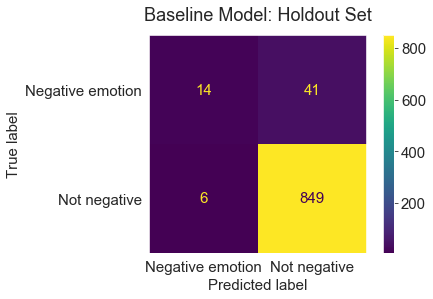

# Twitter Sentiment Analysis

**Author:** Lili Beit
***

## Overview
Google is seeking to increase Android's share of the U.S. smartphone and tablet markets. To do so, they are seeking information on what consumers don't like about their devices. Google hopes to use social media posts to identify complaints and pain points.  Once Google has an understanding of common user frustrations, it can engineer improvements that will attract and retain more customers.

## Business Problem
Google is frustrated that their analysts spend so much time reading through social media posts about mobile devices to find the complaining posts, which comprise just 6% of all posts.  My task is to build a natural language processing model which can identify negative-sentiment posts. They would like analysts to be able to work at least twice as fast while still catching  as many negative posts as possible. So, negative posts should comprise at least 12% of the list returned by the model.

## Data Understanding
To identify posts with gripes, I analyzed over 9,000 tweets from a dataset provided by Crowdflower via [data.world](https://data.world/crowdflower/brands-and-product-emotions).  The tweets all contain references to Google or Apple products by participants in the South by Southwest (SXSW) Conference in 2011.

Each tweet in the dataset was rated by humans as showing a positive emotion, negative emotion, or no emotion toward the Google or Apple product mentioned.  A few were also labeled "I can't tell."  59% of tweets were tagged as postive, 33% as neutral, and 6% as negative, making negative tweets the smallest category aside from "I can't tell."

After tokenization, the tweets contained just 9,780 unique words, and many of these were numbers, symbols, typos, and words combined into hashtag phrases. 

## Modeling

I tested several different methods to vectorize the words in the tweets, and two different Bayesian classifiers to predict whether each tweet was negative-sentiment.

### Baseline Model

The baseline model used a count vectorizer with no maximum features limit, n-grams, or stop words list, and a Multinomial Bayes classifier.  The baseline model's **recall score was 0.12**, and its **precision score was 0.51**, as shown below.  While this model would significantly speed up analysts' work as half of all tweets returned would be truly negative-sentiment, it would not be useful to Google because about 90% of negative-sentiment tweets would be missed.  The model was also overfit, suggesting it relied too heavily on features of the training set.

### Final Model

As described in the [presentation](https://github.com/lilisbeit/Twitter-sentiment-analysis/blob/main/Presentation-Twitter-Sentiment_Analysis.pdf), the final model used a count vectorizer with a maximum feature limit of 1500 words, n-grams up to three words long, and a short stop words list.  It classified the tweets using a Complement Naive Bayesian classifier, which is well-suited to imbalanced datasets.  This model's **recall score was 0.77**, and its **precision score was 0.14**, meaning that Google's analysts can work over twice as fast while losing just 23% of negative-sentiment tweets.  This model was the least overfit of any model tested, showing that it is learning only the information necessary to predict sentiment on new data.

When run against a holdout data set, this model performed even better than it did in testing, with a **recall score of 0.87** and a **precision score of 0.15**.  The confusion matrix from the holdout set is below.

For comparison, the baseline model run on the holdout had a recall score of **0.25** and a precision score of **0.7**, as shown below:

## Conclusions

Identifying negative-sentiment tweets was a challenging problem since they comprised just 6% of all tweets in the dataset.  The final model provides value to Google by enabling analysts to work over twice as fast, while still catching 77% of available negative-sentiment posts.  

The model's precision score was 0.14, meaning that 14 out of every hundred tweets returned by the model are truly negative-sentiment.  Without the model, analysts would find only 6 negative tweets in every one hundred.  The model's 77% recall rate means that most negative-sentiment tweets would be captured by the model.  Since each tweet contains valuable information that can help Google understand customer frustrations, the company would like to capture as many of these tweets as possible.

The final model improved on the baseline model, which identified only 12% of all negative-sentiment tweets, though about half the tweets it returned truly were negative-sentiment.

### Further Investigation

Natural language processing is a complex area of machine learning that has many different tools available for data scientists.  Testing additional vectorizers and models may improve on these results.

While a count vectorizer worked well for this problem, the weakness of a count vectorizer is that it does not account for the meanings of words.  Moreover, words that are not in the training set cannot help drive predictions even if they are in the test set.  Pre-trained vectorizers such as Google's Word2Vec, Stanford's GloVe, and SpaCy may produce better results.

There are several other model types which would be interesting to test with this problem.  Decision trees and support vector machines are robust classification algorithms and may work well.  It would also be interesting to test a neural net.